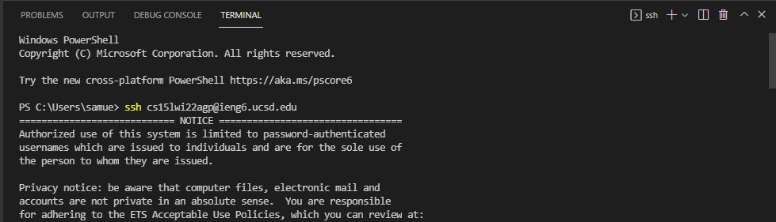
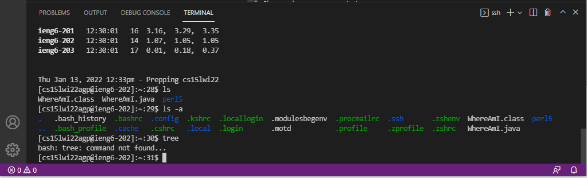
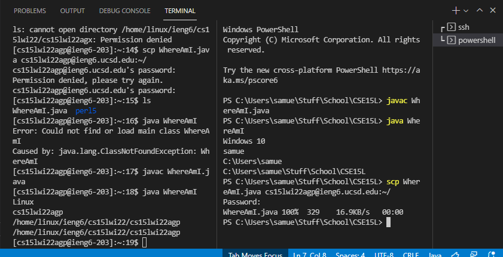
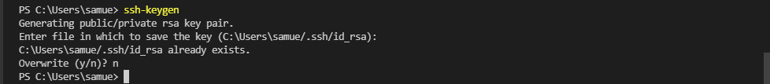
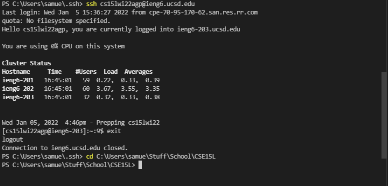

# Lab Report 1
## Remote Access Tutorial

Welcome incoming new CSE15L students!

For this tutorial, I will be showing you how to access the remote SSH server from your local machine.

## Step 1: Installing VScode (or anything that has a commandline)

* To get started, install Visual Studio code [here](https://code.visualstudio.com/download)
* When prompted with instructions, just set up whatever you're comfortable with (most likely just press continue)

## Step 2: Remote connection

* When entering a file or when pressing the "Open terminal" button, you will get something that looks like this window above
* Inside you can use your personal account that has been created for you by the school. Looks something like: `cs15lwi22xxx@ieng6.ucsd.edu` "xxx" being replaced by your unique 3 letter code.
* Finally type the command `ssh cs15lwi22xxx@ieng6.ucsd.edu` and you will be prompted with password. This is activated to be a password that you reset first at the account look up [tool](https://students.ucsd.edu/campus-services/technology/computers/index.html). 

## Step 3: Try out some commands

* Go ahead and try out some commands like `ls` or `ls -a` to show you the files that you have in the current directory

## Step 4: Moving files with SCP

* With the command `scp "name of your file" "destination"` you can copy over a file that you have on your local computer into the working directory of the server that you are currently logged in at.
* You can check if its actually there by using the `ls` command again to check.

## Step 5: Setting a SSH Key

* Using the command `ssh-keygen` you can create and then declare the location of where to save a private key. This allows you to login to your SSH account without entering your password (like face ID)
* After key creation, login to your SSH. Make sure to save the public key to the list of public keys so that your server account can recognize your local machine.

## Step 6: Streamline Remote Running!!

* Finally when everything is up and running, you should beable to just use a single command to login to your ssh. Password is not required since your machine has a matching key to the one on the server.
* Not having to type in your password reduces the time it takes for you to do small but necessary tasks i.e login. But now you will save that time!