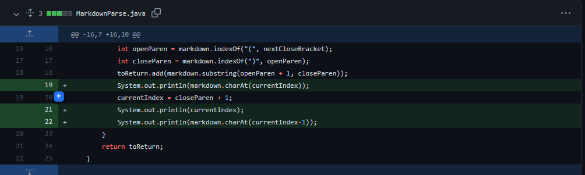
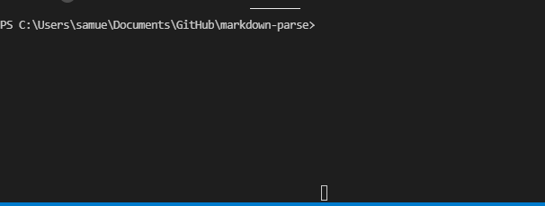
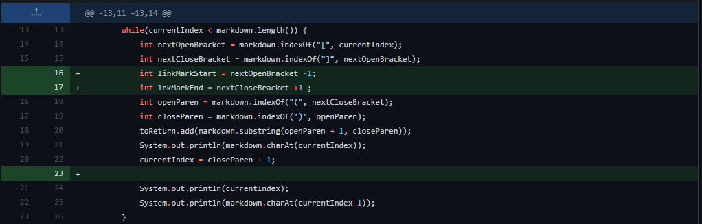
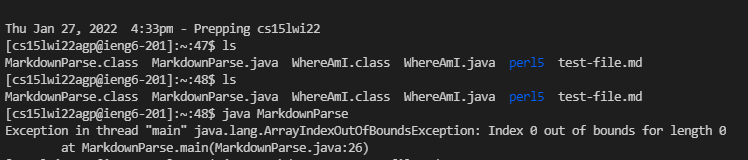
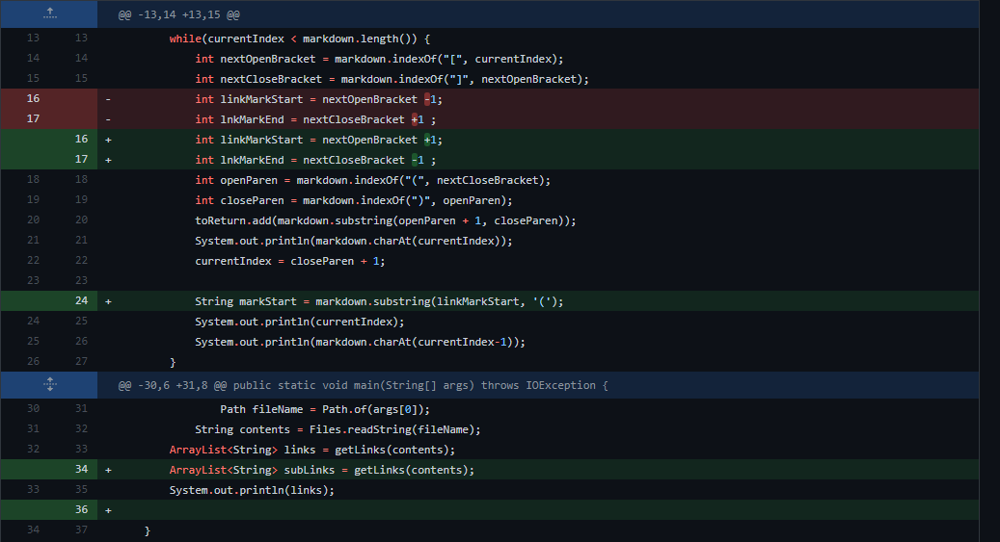
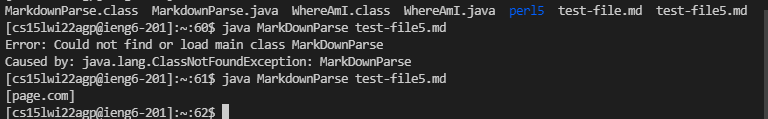

# Lab Report 2
## Coding changes to fix bugs in program

### Problem 1:

The program is unable to identify the end of a a while loop since there is no end condition.
[Problem 1 Link](test-file.md)

The bug in this program that we fixed later was that there would be no end condition in the loop since it cannot find the right bracket. The symptom is that there incurs and infinite loop in the system. The failure inducing input was the extra line at the end of the markdown file.

### Problem 2:

The problem indexes the markdown file with an index counter and it goes out of bounds.
[Problem 2 Link](test-file2.md)

The bug was that there was a really small shift in the index counter and was off by a single edge case. The symptom of this was that the array index would go over the file size and out of bounds. The failure inducing input was the extra size.

### Problem 3:

The problem was that the wrong output was inquired. 
[Problem 3 Link](test-file5.md)

The program should be able to find ALL links in the file not just the ones that are marked with parenthesis and so this problem occured. The symptom is that the wrong output was found. The failure inducing input was using a different set of link markers.

