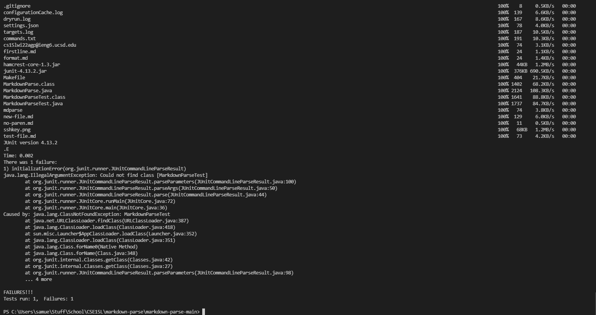

# Lab Report 3
## Using "Secure Copy, Recursive", Group Choice 3

## Why use "scp"
* There are times when files are needed on a remote server and we know that we can copy over the files with the command `scp` in the terminal. 

## Advantages of scp -r
* But there are also times when we want to copy over the entire directory with all the contents. 
* This could be like an entire repository, or and entire folder of dependancies. 

* This is where the command `scp -r` becomes particularly useful. 
* What it does is that it recursively calls the `scp` command on every thing that it finds in the directory targeted.

## Example
* To get this working, I have created and example below:
* Command used for `scp -r`:

* Final Output

* Now that we have the directory copied over, we can take a look to check if its there on our ieng6 remote account!
* Command used to login first:

* Command to complie and run tests in ieng6:

## Streamline
* Finally, combine multiple commands into a single line in order to smooth out the work flow.
* Command used:

* Output
