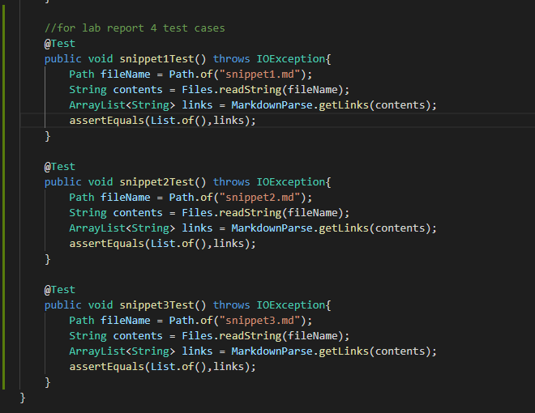
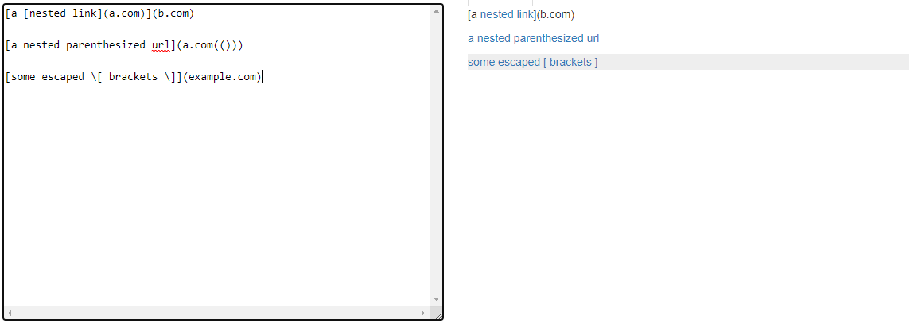

# Lab Report 4
## Reviewing Other Group Repository & Testing

>[Link to Reviewed Repository](https://github.com/ExtraExaByte/MarkDownParse)

After creating the 3 snippet files and creating test cases for them, I ran the tests and the output is shown below:

### Creating MY test cases:
* Test cases written for MY implementation:

### Preview of the 3 tests:
* Snippet 1 Preview:

* Snippet 2 Preview:

* Snippet 3 Preview:

### MY test cases:
* MY test case 1 output:

* The test case failed at trying to find the arraylist of links and comparing them to actual file of links.

* MY test case 2 output:

* The test case failed at trying to identify links within one open bracket and one closed bracket. But the file has nested links which reset the counter and make the program toss it as a link.

* MY test case 3 output:

* The test case failed because the indexer for finding the "charAt" for the brackets went off the end. Most likely because it didn't find a close bracket first.

* Test cases written for REVIEWED implementation:

### Creating REVIEWED test cases:

### REVIEWED test cases:
* Reviewed test case 1

* The test case failed at trying to identify the links with the ruleset of one open bracket and one closed bracket. The back ticks interrupt the logic of the program.

* Reviewed test case 2

* The test case failed trying to find links since there were nested brackets in the link brackets themselves so the program fails at the first assertion.

* Reviewed test case 3

* The test case failed trying to find links with the bracket ruleset. There are line breaks so the counter may have not been able to traverse the link breaks.

### Possible Fixes:

* A possible fix to snippet 1 with less than 10 lines could be to add another method that checks for backticks specifically and exclude them from the "links" arraylist. This would give the program a way to see backticks and troubleshoot them.

* A possible fix to snippet 2 with less than 10 lines could be to add another if statement to the getLinks method that identifies when there is a nested link, this will keep track of both indices and not identify them as not links.

* For snippet 3, there needs to be a more involved fix since there are really long files and strings with huge line breaks. There needs to be another entirelly different method that keeps track of the line breaks and make sure that they are still links. Conjoining this method and the already written methods could potentially solve this issue.