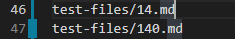
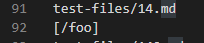
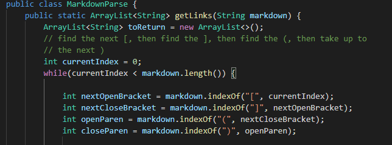
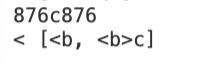
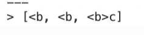
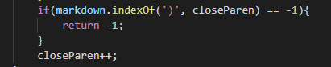

# Lab Report 5
## CommonMark Review

### First Different Test:

How we found the difference:

For the first test that I selected (testfile-14) I manually searched for the name of the file and the output from both results.txt files. I compared the two and saw the difference between the two output from the test file.

Outputs:

* My implementation output of test 14:

* Provided implementation from Lab 9 test 14 output:

* However, the expected output should have been nothing because upon observing the actual test file, there were no links that should have been picked up. If anything there should have been a `[]` as an output. Which means that both implementations had the wrong output.

Bug: 

* For my immplementation, The length of the file in the beginning was too short to pick up on any of the link parameters. Since My implemenation uses index parsing, it will keep looking for a key character. This creates index out of bounds exceptions to be thrown.

### Second Different Test:

How we found the difference:

For this test file, we used the `diff` command to show us the output difference from the two `results.txt` files. For this test I chose testfile-493's output.

Outputs:

* My implementation output of test 493:

* Provided implementation output of test 493:

* My implementation missed the middle link `<b>`, but the provided implemenation caught all 3 links in the file. As expected, the output from test-file493 should have been the three links `[<b, <b, <b>c]`. 

Bug:

* The bug that was in my implementation was that I used a counter to suggest where to get the character from, and using this will offset the array index by 1 which means that concurrent links in file may have one of the links skipped since it compensates for it by moving it forward by one.

